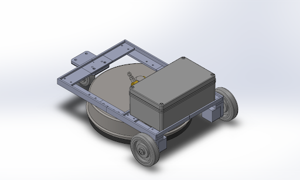

# Pressure Washing Robot

A complete simulation-based project for an autonomous pressure washing robot that can efficiently clean large surfaces while following optimized rectilinear cleaning paths.



## Project Overview

This project implements an autonomous robot system designed for pressure washing large surfaces such as driveways, patios, or parking lots. The robot:

1. Navigates through predefined areas using optimized rectilinear cleaning patterns
2. Avoids obstacles using distance sensors
3. Efficiently covers surfaces with optimal overlap between cleaning passes
4. Provides detailed simulation and path visualization through Webots robotics simulator
5. Follows rectilinear paths with 90-degree turns for complete coverage


## Project Structure

```
├── assets/                     # Project assets
│   └── robotCAD.png            # Robot CAD model image
├── controllers/                # Robot control logic
│   └── robotControl/           # Main robot controller
│       ├── actuators/          # Motor and actuator control modules
│       │   └── motor.py        # Motor control interface
│       ├── config/             # Configuration settings
│       │   └── robot_config.py # Robot parameters and cleaning areas
│       ├── navigation/         # Path navigation logic
│       │   └── navigator.py    # Navigation control system (4.0KB)
│       ├── sensors/            # Sensor input processing
│       │   ├── distanceSensor.py  # Proximity detection
│       │   ├── laserRange.py      # Laser rangefinder interface
│       │   ├── wheelSensors.py    # Wheel encoder interface
│       │   └── digitalCompass.py  # Orientation detection
│       ├── utils/              # Utility modules
│       │   ├── motionController.py # Movement control system
│       │   ├── path_planner.py     # Rectilinear path planning
│       │   ├── path_visualizer.py  # Path visualization interface
│       │   ├── sensorManager.py    # Sensor data aggregation
│       │   └── state.py            # Robot state tracking
│       └── robotControl.py     # Main controller entry point
├── scripts/                    # Standalone scripts
│   └── pathGeneration/         # Path generation tools and algorithms
│       ├── PathGenerator.py    # Current production path generator (25KB)
│       ├── PathGeneratorV1.py  # Initial path generator implementation
│       ├── PathGeneratorV2.py  # Improved path generator
│       └── PathGeneratorV3.py  # Enhanced path generator with obstacle avoidance
├── worlds/                     # Webots simulation worlds
│   └── Rectangle_Arena.wbt     # Main simulation environment
└── .gitignore                  # Git ignore file
```

## Features

- **Rectilinear Cleaning Path Generation**: Creates efficient cleaning paths with proper 90-degree turns to ensure complete coverage of different surface shapes (rectangle, L-shape, etc.)
- **Real-time Path Visualization**: Shows the planned path, current position, and actual robot trajectory in a dedicated display window
- **Obstacle Detection and Avoidance**: Uses distance sensors to detect and navigate around obstacles
- **Configurable Cleaning Parameters**: 
  - Surface cleaner diameter
  - Path overlap percentage
  - Edge buffer distance
  - Visualization settings
- **Motion Control System**: Precise control of robot movement and cleaning mechanisms
- **Simulation Environment**: Complete Webots simulation for testing and visualization

## Requirements

- Python 3.8+
- Webots R2023a or newer
- Python packages:
  - numpy
  - opencv-python
  - controller (Webots Python API)

## Installation

1. Install Webots from [cyberbotics.com](https://cyberbotics.com/)
2. Clone this repository:
   ```
   git clone https://github.com/yourusername/pressureWashingRobot.git
   cd pressureWashingRobot
   ```
3. Install required Python packages:
   ```
   pip install numpy opencv-python
   ```

## Usage

### Running the Simulation

1. Open Webots and load the world file:
   ```
   File > Open World > /path/to/pressureWashingRobot/worlds/Rectangle_Arena.wbt
   ```
2. Click the "Play" button to start the simulation
3. A visualization window will appear showing the robot's planned path, current position, and the path taken so far

### Path Visualization

The simulation includes a real-time path visualization window that shows:

- Planned cleaning path with distinct colors for horizontal and vertical segments
- Robot's current position and orientation (red circle with heading line)
- Actual path taken by the robot (blue trail)
- Area boundaries (black outline)
- Start and end points (highlighted with special colors)

You can adjust visualization settings in `controllers/robotControl/config/robot_config.py`:

```python
VISUALIZATION_PARAMS = {
    'enable': True,               # Enable/disable visualization
    'window_name': 'Robot Path Visualization',  # Display name in Webots
    'width': 500,                 # Width in pixels
    'height': 500,                # Height in pixels
    'update_interval': 3,         # Update frequency (every N timesteps)
}
```

### Configuring Cleaning Areas

Cleaning areas can be configured in the `controllers/robotControl/config/robot_config.py` file:

```python
CLEANING_AREAS = {
    'rectangle': [
        {'x': 0.0, 'y': 0.0},     # Starting point
        {'x': 2.8, 'y': 0.0},     # Right edge
        {'x': 2.8, 'y': 3.0},     # Top-right corner
        {'x': 0.0, 'y': 3.0},     # Top-left corner
    ],
    'L_shape': [
        {'x': 0.0, 'y': 0.0},     # Starting point
        {'x': 4.8, 'y': 0.0},     # Right edge of top
        {'x': 4.8, 'y': 1.5},     # Top-right inner corner
        {'x': 1.5, 'y': 1.5},     # Bottom-right inner corner
        {'x': 1.5, 'y': 4.3},     # Top-right outer corner
        {'x': 0.0, 'y': 4.3}      # Top-left corner
    ]
}
```

To switch between different shapes, edit the `robotControl.py` file at line 43:
```python
self.boundary_points = CLEANING_AREAS['rectangle']  # Change to 'L_shape' or other patterns
```

### Adjusting Cleaning Parameters

Path generation parameters can be adjusted in the `robot_config.py` file:

```python
ROBOT_PARAMS = {
    # ...
    'surface_cleaner_diameter': 12,  # Diameter of cleaning head in inches
    'path_overlap': 4,               # Overlap between passes in inches  
    'edge_buffer': 6,                # Buffer from edges in inches
}
```

## Rectilinear Path Generation

The project includes a sophisticated rectilinear path generation algorithm that:

1. Takes boundary points as input
2. Calculates an efficient coverage pattern with 90-degree turns
3. Creates horizontal cleaning passes connected by vertical transitions
4. Ensures proper overlap between passes for complete coverage
5. Provides buffer distance from edges
6. Optimizes total cleaning time
7. Adapts to different shaped areas (rectangular, L-shaped, etc.)

The rectilinear pattern (similar to lawn mowing) ensures complete coverage without missing spots, in contrast to simple zigzag patterns that might leave gaps.

## Acknowledgments

- Webots robot simulator by Cyberbotics
- OpenCV for image processing functionality 