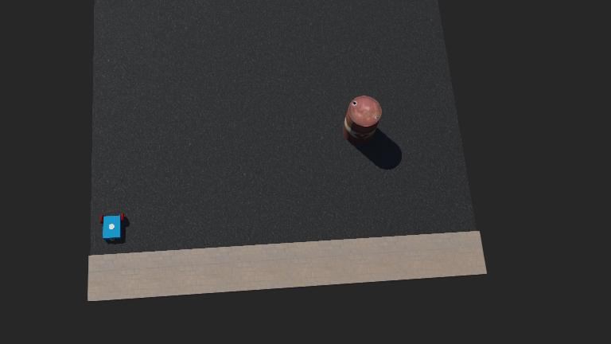

# Pressure Washing Robot

A complete simulation-based project for an autonomous pressure washing robot that can efficiently clean large surfaces while following optimized cleaning paths.



## Project Overview

This project implements an autonomous robot system designed for pressure washing large surfaces such as driveways, patios, or parking lots. The robot:

1. Navigates through predefined areas using optimized cleaning patterns
2. Avoids obstacles using distance sensors
3. Efficiently covers surfaces with minimal overlap between cleaning passes
4. Provides detailed simulation through Webots robotics simulator

## Project Structure

```
├── controllers/            # Robot control logic
│   ├── robotControl/       # Main robot controller
│   │   ├── actuators/      # Motor and water pump controls
│   │   ├── config/         # Robot configuration settings
│   │   ├── navigation/     # Path navigation logic
│   │   ├── sensors/        # Sensor input processing
│   │   ├── utils/          # Utility functions
│   │   └── robotControl.py # Main controller code
│   └── scripts/
│       └── pathGeneration/ # Path planning algorithms
│           └── PathGenerator.py # Latest path generation algorithm
├── worlds/                 # Webots simulation worlds
│   └── Rectangle_Arena.wbt # Main simulation environment
└── .gitignore              # Git ignore file
```

## Features

- **Optimized Cleaning Path Generation**: Creates efficient cleaning paths to cover different surface shapes (rectangle, L-shape, etc.)
- **Obstacle Detection and Avoidance**: Uses distance sensors to detect and navigate around obstacles
- **Configurable Cleaning Parameters**: 
  - Surface cleaner diameter
  - Path overlap percentage
  - Edge buffer distance
- **Motion Control System**: Precise control of robot movement and cleaning mechanisms
- **Simulation Environment**: Complete Webots simulation for testing and visualization

## Requirements

- Python 3.8+
- Webots R2023a or newer
- Python packages:
  - numpy
  - opencv-python
  - controller (Webots Python API)

## Installation

1. Install Webots from [cyberbotics.com](https://cyberbotics.com/)
2. Clone this repository:
   ```
   git clone https://github.com/yourusername/pressureWashingRobot.git
   cd pressureWashingRobot
   ```
3. Install required Python packages:
   ```
   pip install numpy opencv-python
   ```

## Usage

### Running the Simulation

1. Open Webots and load the world file:
   ```
   File > Open World > /path/to/pressureWashingRobot/worlds/Rectangle_Arena.wbt
   ```
2. Click the "Play" button to start the simulation

### Configuring Cleaning Areas

Cleaning areas can be configured in the `controllers/robotControl/config/robot_config.py` file:

```python
CLEANING_AREAS = {
    'rectangle': [
        (0, 0),
        (9, 0),
        (9, 9),
        (0, 9)
    ],
    'L_shape': [
        # Define L-shape coordinates here
    ]
}
```

### Adjusting Cleaning Parameters

Path generation parameters can be adjusted in the path generator:

- Surface cleaner diameter (in inches)
- Path overlap (in inches)
- Edge buffer radius (in inches)

## Path Generation

The project includes a sophisticated path generation algorithm that:

1. Takes boundary points as input
2. Calculates an efficient coverage pattern
3. Ensures proper overlap between passes
4. Provides buffer distance from edges
5. Optimizes total cleaning time

## Contributing

Contributions are welcome! Please feel free to submit a Pull Request.

## License

This project is licensed under the MIT License - see the LICENSE file for details.

## Acknowledgments

- Webots robot simulator by Cyberbotics
- OpenCV for image processing functionality 